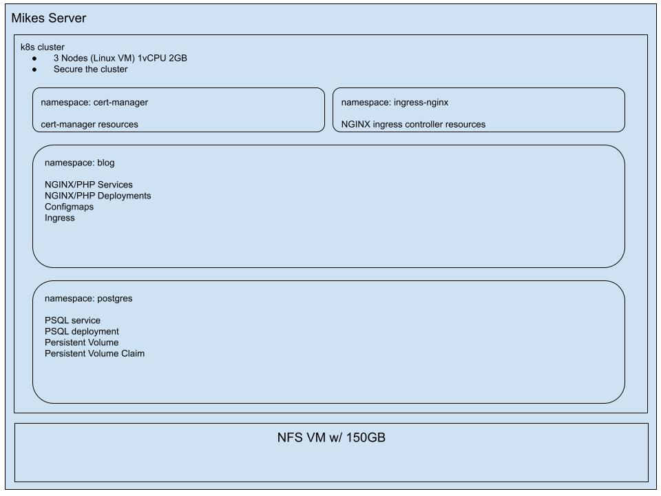
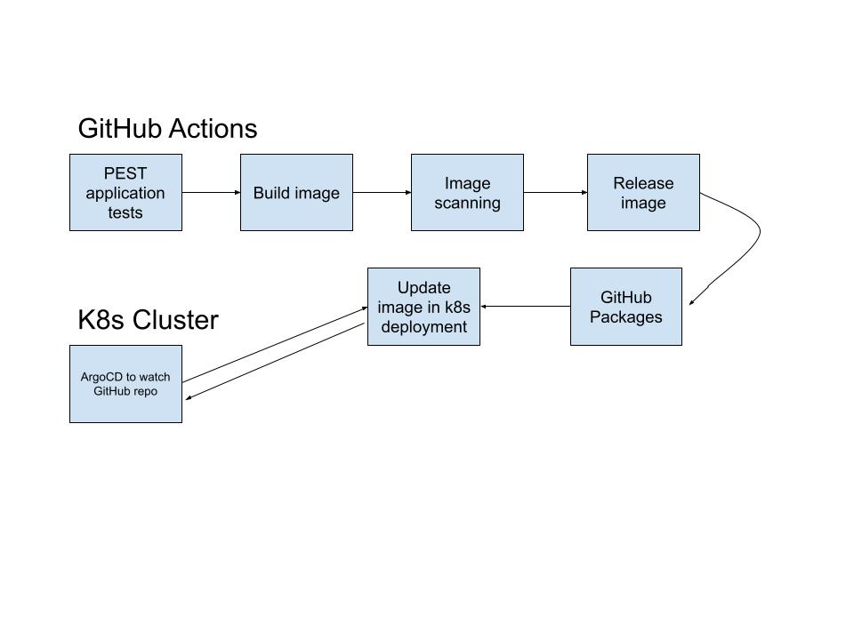
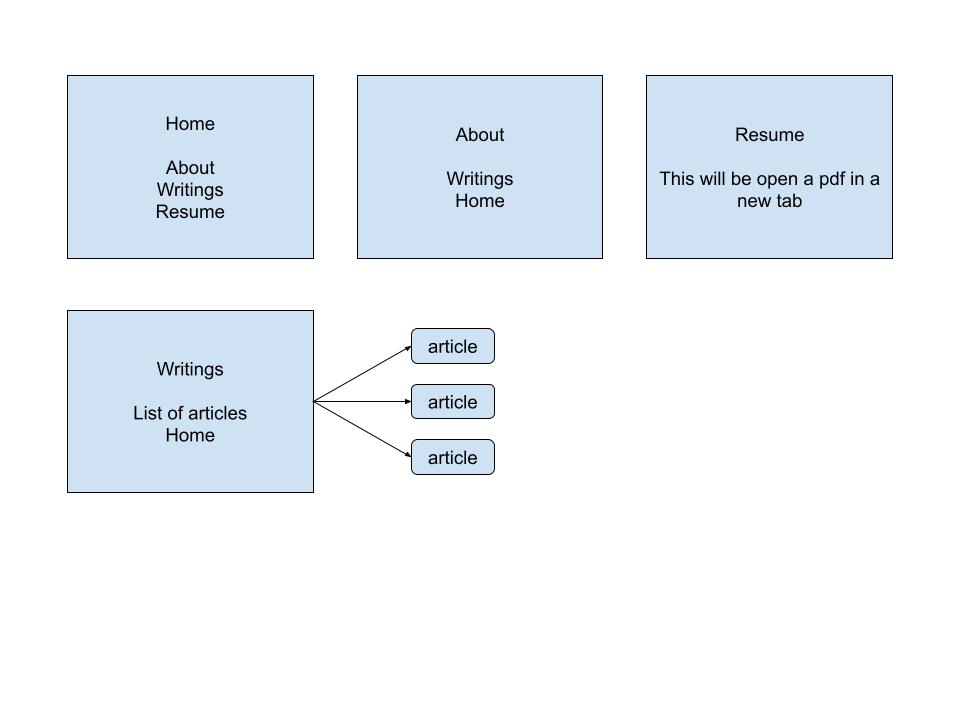

## Goals

The following sections describe some of my goals for this project.

### Agnostic deployments

This blog application, if you were to just look at it, doesn't seem very technically complicated. The front-end itself really isn't anything crazy and the backend is really just PostgreSQL with a single table holding data for the blog posts.

One goal I have is to be able to deploy this application wherever I want to, in case I need to swap cloud providers, or migrate to a bare metal setup, for instance. As part of that, I opted to containerize my Laravel/PHP application and serve it using `k8s`.

### Cost savings

Another goal, as is a goal for most people or organizations, is costs savings. I'm fortunate that I have some friends with hardware that are generous enough to let me use it. This is going to save a ton of money on cloud spend, in the long run, or at least that's my belief right now. 

### Production experience

Beyond the goal of saving, I also do really want to manage and administor my own production cluster. It's what gets potential employers going, years of production level experience. When I say "production" here I really just mean something that's available on the internet and secure, nothing more, not yet anyway.

I've created a few basic diagrams that I'll share here and also, here's a link to the [FIGMA designs I created for the front-end](https://www.figma.com/design/qC6PFaau1omTICX5KoVvib/dumpster---blog?node-id=0-1&t=wjGYBhV5YgYNIJCn-1). Now is probably a great time to mention that I'm not a super experienced designer/front-end person, in general. I understand HTML/CSS to the point where I can read it and understand things. I know it's important to think about accessibility and I tend to opt for a "mobile-first" approach when it comes to building a web page.

## Diagrams

I like to have visual representations of the work I'm doing, so if I forget anything in the moment, I can refer back to things like this and stay within scope.

### Architecture diagram

This one is a rough outline of how I'm planning to organize/deploy things on bare metal.

### CI/CD diagram

This shows the flow for the CI/CD pipeline, I'll be using a GitOps workflow and utilizing ArgoCD.

### Sitemap diagram

This was just something I threw together to help make sense of things. I ened up not even really doing this and the navigation is the same on every page. I kept it because it shows that even when you don't keep what you start with, it was helpful.

